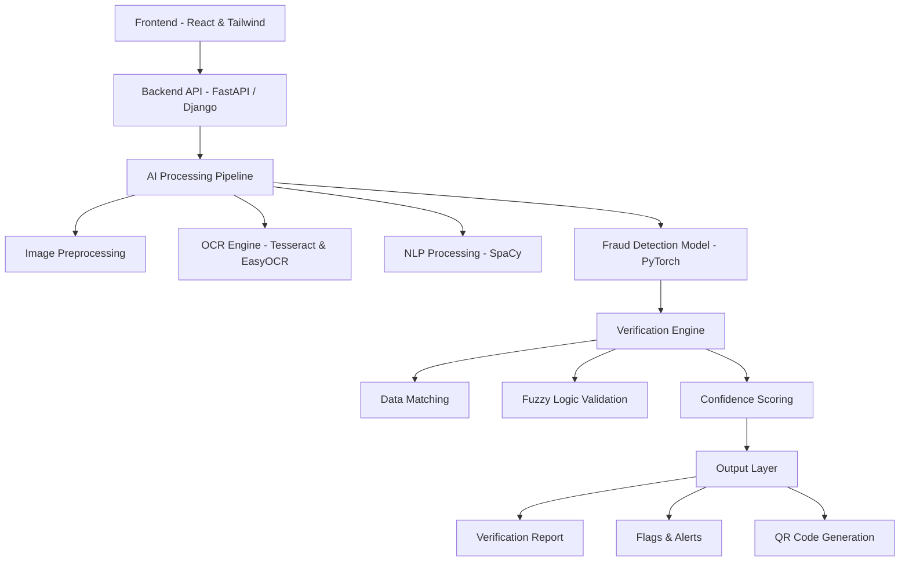

# 🚀 DocuVerify AI  
### AI-Powered Document Verification Platform for Scalable Recruitment Systems  

<p align="center">
  
  
  
  
</p>

---

## 📌 Overview  

DocuVerify AI is an intelligent document verification system that automates large-scale recruitment workflows using AI.  

It replaces slow, manual verification with a fast, scalable system that extracts, validates, and verifies documents in seconds — even across multiple languages and poor-quality inputs.  

---

## 🚨 Problem Statement  

Large-scale recruitment systems process **thousands of applications**, each with multiple documents.  

### Key Challenges:
- ⏳ 30 minutes per application  
- 📉 5–7% error rate  
- 👥 High manpower requirement  
- 🕒 2–3 months delay in results  

### At Scale:
- 500+ recruitment bodies  
- 10+ million applicants annually  

👉 Result: Delayed hiring, inefficiency, and poor candidate experience  

---

## 💡 Solution  

DocuVerify AI automates the entire document verification pipeline:

- 📄 AI-based data extraction  
- 🔍 Intelligent matching with application data  
- ⚠️ Fraud & inconsistency detection  
- 📊 Confidence-based verification reports  
- ✅ One-click approval workflow  
- 🔐 QR-based verification system  

---

## ⚙️ Features  

### 📂 Multi-Format Processing  
- Supports PDFs 

### 🧠 AI Data Extraction  
- Tesseract + EasyOCR  
- NLP-based entity extraction 

### 🔍 Intelligent Matching  
- Fuzzy matching  
- Handles spelling + transliteration differences

### 🎯 Fraud Detection  
- Cross-document validation  
- Metadata analysis

### ⚡ Confidence-Based Decisions  
- 80% automated approvals  
- Flags only critical cases  

### 🔐 QR Code Verification  
- Secure, instant verification  
- Shareable verification proof 

---

## 🏗️ System Architecture  

DocuVerify AI follows a modular and scalable architecture designed for high-volume document processing.



---

## 🔄 Data Flow  

### Step-by-Step Flow  

1. **User Uploads Documents**  
   - Accepts PDFs 

2. **Preprocessing Layer**  
   - Enhances image quality  
   - Removes noise and improves readability  

3. **OCR & Text Extraction**  
   - Multi-engine OCR extracts multilingual text  

4. **Document Classification**  
   - Identifies document type (certificate, ID, etc.)  

5. **NLP Processing**  
   - Extracts key entities (name, DOB, ID numbers)  

6. **Fraud Detection Layer**  
   - Uses ML model (PyTorch)  
   - Detects inconsistencies and anomalies  

7. **Data Matching Engine**  
   - Compares extracted data with application input  
   - Uses fuzzy matching for real-world variations  

8. **Confidence Scoring System**  
   - Assigns trust score  
   - Routes cases (auto / review / reject)  

9. **Final Output Generation**  
   - Verification report  
   - Flagged issues  
   - QR-based verification  

---

## ⚡ Processing Strategy  

- ⚡ **Parallel Processing** for documents  
- 🎯 **Confidence-based routing** (Auto / Manual review)  
- 📈 **Continuous learning system** (improves over time)  
- ☁️ **Cloud-scalable architecture**  

---

## 🔐 Security & Reliability  

- Secure document handling  
- Scalable deployment  
- Audit-ready verification logs  

---

## 📊 Impact  

| Metric | Improvement |
|------|--------|
| ⏱ Time | 30 min → **3 sec** |
| ⚡ Speed | **600x faster** |
| 🎯 Accuracy | **98%** |
| 💰 Cost | ₹100 → ₹2–₹5 |
| 🌍 Scale | Millions of users |

---

## 🏗️ Tech Stack  

### Frontend  
- React.js  
- Tailwind CSS
- Recharts

### Backend  
- FastAPI / Flask  
- REST APIs  

### AI/ML  
- PyTorch
- Tesseract OCR  
- EasyOCR  
- SpaCy (NLP)
- Fraud Detection Model
- Classification Model

### Deployment  
- Vercel  

---

## ⚙️ Local Setup Instructions  

Follow these steps to run the project locally 👇  

---

### 🔧 Prerequisites  

Install the following:

- Node.js (v16+)  
- Python (3.8+)  
- pip  
- Git  

#### Install Tesseract OCR  

Download and install from:  
👉 https://github.com/tesseract-ocr/tesseract  

After installation:  
- Add Tesseract to system PATH  

---

### 📥 Step 1: Clone Repository  

```bash
git clone https://github.com/your-username/DocuVerifyAI.git
cd DocuVerifyAI
```

### ⚙️ Backend Setup

```bash
# Navigate to backend folder
cd backend

# Create virtual environment
python -m venv venv

# Activate virtual environment

# Windows
venv\Scripts\activate

# Mac/Linux
source venv/bin/activate

# Install dependencies
pip install -r requirements.txt

# Run backend server
uvicorn main:app --reload
```

### 💻 Frontend Setup

```bash
# Navigate to frontend folder
cd frontend

# Install dependencies
npm install

# Run development server
npm run dev
```
---

## 🚧 Challenges & Limitations  

- Limited dataset for smaller institutions  
- Lack of government verification APIs  
- Handwritten documents have lower accuracy  
- Adoption challenges in government workflows  

---

## 🔮 Future Scope  

- Integration with DigiLocker and government APIs  
- Improved dataset coverage across institutions  
- Advanced fraud detection using deep learning  
- Mobile app for on-field verification  
- Blockchain-based verification records  

---

## 📌 Use Cases  

- Government Recruitment Boards  
- Universities & Colleges  
- Public Sector Units (PSUs)  
- Private Hiring Platforms  

---

## 🎯 Why This Project Stands Out  

- Solves a **real-world, national-scale problem**  
- Built specifically for **India**  
- Combines **AI + scalability + usability**  
- Reduces verification time from **months → seconds**  
- Ready for **real-world deployment**  

---
 
## 🏁 Conclusion  

DocuVerify AI transforms document verification from a slow, manual process into a fast, intelligent, and scalable system — enabling faster recruitment, reduced errors, and better decision-making.  

---

## ⭐ Support  

If you like this project, give it a ⭐ on GitHub! 
